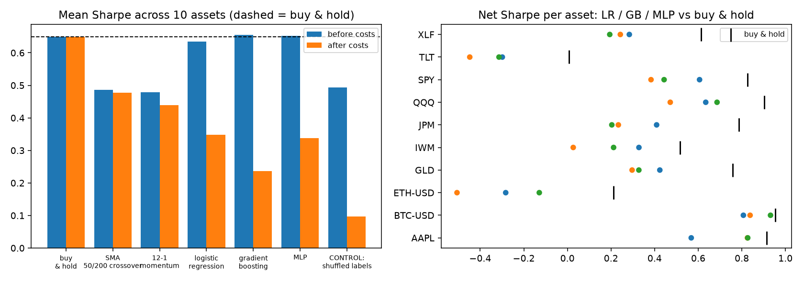

# trade-arena

An honest answer to "which model should trade this?": classic rules and three learned models (logistic regression,
gradient boosting, MLP) on 10 real assets (US stocks, ETFs, BTC, ETH), tested **walk-forward**, **net of costs**,
against buy-and-hold, with bootstrap confidence intervals and a shuffled-label control.



## Result in one line

**No strategy beat buy-and-hold on risk-adjusted return.** Before any costs the learned models merely matched
buy-and-hold; their heavy turnover then made them worse. They scored above a shuffled-label control, so a weak signal
may exist, but it was far too small to pay for its own trading costs.

## Setup

- Assets: SPY, QQQ, IWM, TLT, GLD, XLF, AAPL, JPM, BTC-USD, ETH-USD; daily adjusted closes (Yahoo Finance via `yfinance`).
- Walk-forward: each calendar year the model is retrained on data strictly before that year (last training row purged,
  because its label uses the first test day's return) and predicts that year. First test year per asset: AAPL 2015, BTC-USD 2019, ETH-USD 2022, GLD 2015, IWM 2015, JPM 2015, QQQ 2015, SPY 2015, TLT 2015, XLF 2015.
- Strategies are long/flat, decided at the close, earning the next day's return. Costs: 10 bps (equities/ETFs) and
  20 bps (crypto) per unit of turnover, covering fees and slippage.
- Features (price-only, causal): returns over 1-60 days, 20/60-day volatility, RSI-14, distance from 50/200-day
  averages, 12-1 month momentum. Models use fixed, untuned hyperparameters, deliberately, so no result comes from
  tuning against the test years.
- Control: the gradient-boosting pipeline trained on shuffled labels. It has no information by construction.

## Results (mean over 10 assets)

| Strategy | Sharpe before costs | Sharpe after costs | CAGR | Max drawdown | Round trips / yr | Beat B&H | Sig. better | Sig. worse |
|---|---|---|---|---|---|---|---|---|
| buy & hold | 0.65 | 0.65 | 14.8% | -46% | 0.1 | - | - | - |
| SMA 50/200 crossover | 0.49 | 0.48 | 8.8% | -43% | 1.5 | 0/10 | 0 | 0 |
| 12-1 momentum | 0.48 | 0.44 | 9.2% | -44% | 7.1 | 1/10 | 0 | 3 |
| logistic regression | 0.63 | 0.35 | 5.6% | -48% | 56.5 | 0/10 | 0 | 5 |
| gradient boosting | 0.65 | 0.24 | 3.6% | -51% | 77.8 | 0/10 | 0 | 7 |
| MLP | 0.65 | 0.34 | 6.8% | -47% | 59.1 | 0/10 | 0 | 6 |
| CONTROL: shuffled labels | 0.49 | 0.10 | -0.6% | -56% | 73.7 | 0/10 | 0 | 9 |

"Beat B&H" counts assets where net Sharpe exceeds buy-and-hold; "Sig." uses a 20-day block bootstrap 95% CI on the
Sharpe difference (2,000 resamples).

Direction accuracy (mean over assets): logistic regression 52.0%, gradient boosting
51.7%, MLP 51.3%, versus **52.7% for always predicting "up"**.

## What this says

- Learned models called direction correctly less often than a model that always says "up". In a rising market most of
  their positive performance is just being long most of the time.
- Gross of costs they reach buy-and-hold's Sharpe and no more. Their 56-78 round trips a year then cost them roughly
  0.3-0.4 of Sharpe, so after costs they are significantly worse than buy-and-hold on 5-7 of 10 assets.
- They do score above the shuffled-label control (net 0.24-0.35 vs 0.10), so there may be a weak signal, but far too
  weak to pay for its own turnover.
- Simple, slow rules (SMA crossover, momentum) lose little to costs but still do not beat holding; they trim average
  max drawdown only slightly (-43% and -44% vs -46%) while giving up about 5-6 points of annual return.

## Caveats (read these)

- This is one sample of history, 2015-2026, mostly a bull market, and crypto has a shorter window (BTC from 2019,
  ETH from 2022). Conclusions about "no edge" apply to these features, models and this frequency, not to trading in general.
- Survivorship bias: the stocks (AAPL, JPM) and ETFs were chosen with hindsight and are winners; this flatters
  buy-and-hold, which is the benchmark everything lost to.
- Long/flat, daily bars, price-only features. No shorting, leverage, intraday data, order-book data, alternative
  data or portfolio construction, which is where real quant edge is sought.
- Cost assumptions are reasonable round numbers, not a model of any broker. Yahoo data is for personal use; check its
  terms before redistributing results built on it.
- Not investment advice. Nothing here is a trading system.

## Run

```bash
pip install yfinance pandas numpy scikit-learn matplotlib pytest
python -c "import yfinance as yf; yf.download(['SPY','QQQ','IWM','TLT','GLD','XLF','AAPL','JPM','BTC-USD','ETH-USD'], start='2010-01-01', auto_adjust=True, progress=False)['Close'].to_csv('prices.csv')"
python run.py && python -m pytest tests   # ~2 min; 9 tests incl. a look-ahead leak test
```
